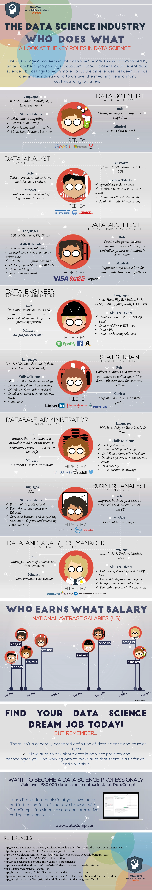

Lots of different article sources for week 1:

## Lecture slides:

#### 1. Data Engineering: 
- data preparation, **model operationalisation** & software engineering (week 6)
- Data processing **pipelines** & feature stores
- Operationalise & model stores 
- **prediction-as-a-service**
- **Software engineering:** OO programming, git, automated testing, automate decision points
- Data warehousing & ETL (extract, transform, load)

#### 2. Data Science: 
- **prediction, insights & research**
- Prediction vs Insights (week 3)
- Research: making it better & easier for us all
- Cutting edge applications: 
  - do our work, 
  - make our work/life easier
  - make things better for us

#### 3. Full Stack Developer: 
- your **channels** to your customers/users
- Build your channels
- Measure your channels
- Improve your channels

- Purpose: Looking at different roles to identify what kind of data scientist you aim to become.

#### 4. Business Skills (week 4)
- Growth areas: new opportunities
- Focus areas: biggest margin/profit
- Issues areas: improvements/solutions

#### 5. Consulting Skills: people skills, relationship building and stakeholder management (week 8 and 9)
- Never eat alone: make time to reach out and get to know people
- Be a doctor: see beyond people's asks to identify their actual needs
- Being valuable will open you many doors (even more if you're nice)
- Build powerful & compelling stories based on your findings

#### 6. Domain Knowledge
- You need it
- Acquiring one means you can acquire many
- Find the toughest business analyst and build things to their standard

--------------------

Sources:
- [ ] Lecture slides
- [ ] Course introduction
- [ ] Video: [Video: Roles from Lynda.com]
- [ ] Report: [2017 Data Scientist Report, CrowdFlower]
- [ ] Report: [2018 Data Scientist ReportPreview the document, Figure Eight]
- [ ] Report: [Data Science Career Paths: Roles in the Industry, Roger Huang, Springboard, 28 March, 2016]
- [ ] Infographic: [Infographic: The Data Science Industry: Who Does What, Karlijn Willems, DataCamp, 10 November, 2015]
- [ ] Report: [What Makes a Great Data Scientist, SAS Report, 2014]
- [ ] Report: [Roles of data scientist and course overview]
- Course Learning Outcomes

----------------------

#### Course Learning Outcomes:
tldr:
- ethical standards
- legal issues
- Social issues in data-science
- privacy threats

longer:
- Apply relevant standards, ethical and social considerations, and thus demonstrate an understanding of legal issues to the professional practice of data science
- Analyse and discuss social impact and professional issues in the realm of data science, in particular evaluate solutions to privacy threats within the context of data science practice in industry
- Analyse and evaluate professional practice case studies in teams, and critically assess the work of peers
- Communicate effectively to a variety of audiences through a range of modes and media, specifically, through written technical reports and oral presentations

Source: [Datacamp infographic]

[Datacamp infographic]: https://www.datacamp.com/community/tutorials/data-science-industry-infographic

[Video: Roles from Lynda.com]: https://www.lynda.com/Big-Data-tutorials/Roles/420305/505107-4.html
[2017 Data Scientist Report, CrowdFlower]: https://visit.figure-eight.com/rs/416-ZBE-142/images/CrowdFlower_DataScienceReport.pdf
[2018 Data Scientist ReportPreview the document, Figure Eight]: https://rmit.instructure.com/courses/17070/files/4389249/download?wrap=1
[Data Science Career Paths: Roles in the Industry, Roger Huang, Springboard, 28 March, 2016]: https://www.springboard.com/blog/data-science-career-paths-different-roles-industry/
[Infographic: The Data Science Industry: Who Does What, Karlijn Willems, DataCamp, 10 November, 2015]: https://www.datacamp.com/community/tutorials/data-science-industry-infographic
[What Makes a Great Data Scientist, SAS Report, 2014]: https://www.sas.com/content/dam/SAS/en_gb/image/other1/events/WMAGDS/DataScientist-survey-report-web%20FINAL.pdf
[Roles of data scientist and course overview]: https://rmit.instructure.com/courses/17070/files/4379737/download?wrap=1