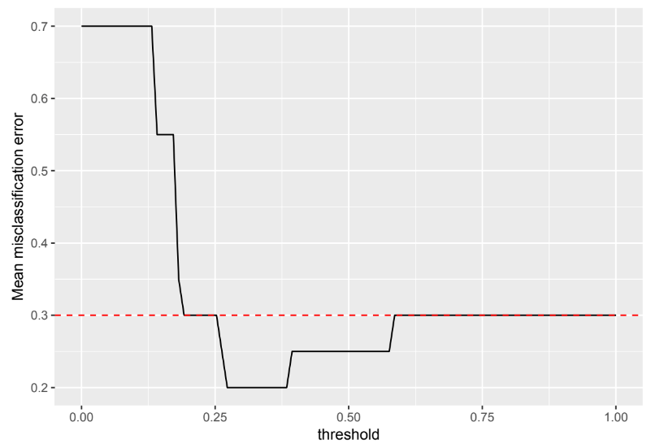

```{r setup, include=FALSE}
knitr::opts_chunk$set(echo = TRUE, eval =TRUE)
```

# Before we start: `rJava` issue again

* `rJava` issues on Windows 64 Bit
* Kristoffer Lowenstein discovered the solution. 


> The trick was to uninstall java and install the 64-bit version. However it is only possible to install the 64-bit version from the offline installer which can be found here:  https://www.java.com/en/download/manual.jspLinks to an external site.

> And include the following line at the top of R script: 

```{r, eval = FALSE}
Sys.setenv(JAVA_HOME='C:\\Program Files\\Java\\jre1.8.0_171')
```


# Hyperparameter

* How to find them from a learner? Use `getParamset`
* Naive Bayes: one only paramater

```{r, warning = FALSE, message = FALSE}
library(mlr)
getParamSet("classif.naiveBayes")
```

* How to configure a range of parameter values?
* Also known as search space

```{r}
discrete_ps <- makeParamSet(
  makeDiscreteParam("laplace", values = c(0, 1, 3, 4, 10))
)
```

# More than one parameter

* Example: Support Vector Machine (SVM) under `kernlab`

```{r}
num_ps <- makeParamSet(
  makeNumericParam("C", lower = -10, upper = 10),
  makeNumericParam("sigma", lower = -10, upper = 10)
)
```

* More on SVM in the last week if time permits
* Mixed parameter configuration

```{r, eval = FALSE}
makeParamSet(
  makeNumericParam("u", lower=1),
  makeIntegerParam("v", lower=1, upper=2),
  makeDiscreteParam("w", values=1:2),
  makeLogicalParam("x"),
  makeDiscreteVectorParam("y", len=2, values=c("a", "b"))
)
```

# Specifying the optimization algorithm

* Need to choose an optimization algorithm for our parameters to pass to the learner
* A grid search is standard but slow

```{r}
ctrl <- makeTuneControlGrid()
```

* For `discrete_ps`, we have 5 combinations
* For `num_ps`, we have a space `C` $\times$ `sigma`
* How many steps for numeric parameters:

```{r}
ctrl <- makeTuneControlGrid(resolution = 15L)
```

# Perform tuning

* Resampling to assess the quality of a specific parameter setting

```{r}
rdesc <- makeResampleDesc("CV", iters = 3L)
```

* Matching all pieces

```{r, eval = FALSE}
res <- tuneParams("classif.<>", task = <your_task>, 
                 resampling = rdesc,
                 par.set = discrete_ps, control = ctrl)
```

# Naive Bayes: Smoothing

* Check error rate changes with a range of Laplace parameter values
```{r, eval = FALSE}
generateHyperParsEffectData()
```

* When to use Laplace smoothing? Warm-Up example
* When not to use Laplace smoothing? R Practice

# Adjusting  Probability  Threshold

```{r echo=FALSE, out.width='100%'}

```

# Help and Practice Session
