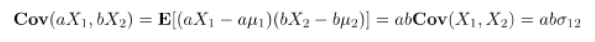

# 1.

```SAS
proc iml;
reset print;

A = {
     2 2,
    -1 1
};

B = {
     5  1,
     4 -2,
    -1  2
};

C = {
     6,
    -2,
     1  
};

A_transposed = T(A);
B_transposed = T(B);
C_transposed = T(C);
```

## 1.a) C'B

`Ctransposed_x_B = C_transposed * B;`

|  |  |
| --- | --- |
| 21 | 12 |

## 1.b) A'B'

`A_transposed_x_B_transposed = A_transposed * B_transposed;`

|  |  |  |
| --- | --- | --- |
| 9 | 10 | -4 |
| 11 | 6 | 0 |

## 1.c) BA

`B_x_A = B * A;`

|  |  |
| --- | --- |
| 9 | 11 |
| 10 | 6 |
| -4 | 0 |

## 1.d) BA

`A_x_B = A * B;`

- A row length = 2
- B col length = 3
<br/>
-> So it's not possible to multiply A * B

Also, sass gives us this error:

`ERROR: (execution) Matrices do not conform to the operation.`

# QUESTION 2

## a) Calculate G = F'F

```SAS
F = {
  4 0 0,
  0 9 0,
  0 0 1
};

F_transpose = T(F);

G = F * F_transpose;
```

## b) Eigenvalues


```SAS
G_eigenvalues = eigval(G);
```

|  |
| --- |
| 81, |
| 16, |
| 1 |

## b) Eigenvectors

```SAS
G_eigenvector = eigvec(G);
```

|  |  |  |
| --- | --- | --- |
| 0 | 1 | 0 |
| 1 | 0 | 0 |
| 0 | 0 | 1 |

# QUESTION 3.

You are given:

#### random vector  

`X'= [ X1 , X2 , X3 , X4 ]` with

#### mean vector

μ<sub>X</sub> = [4, 3, 2, 1]  

#### variance-covariance matrix =

Σ<sub>X</sub> =<br />
[2 0 2 4,<br/>
2 1 9 2,<br/>
0 1 1 0,<br/>
3 0 2 2]


Partition X as:<br/>
x => X = [X<sub>1</sub>, X<sub>2</sub>,  X<sub>3</sub>, X<sub>4</sub>]
=> [<br/>
  X<sup>a</sup><br/>
  ...<br/>
  X<sup>b</sup><br/>
]

  X<sup>a</sup><br/> =

Let
A' = [1 −1] and
Note: We have to `transpose` A to make it work

B = [
2 -1,
0  1
]

Consider the linear combinations AX<sup>(1)</sup> and BX<sup>b</sup> to find:

## a) E(X<sup>a</sup>) = μ<sub>x</sub>

let X<sup>a</sup> include X<sub>1</sub> and X<sub>2</sub>

μ<sub>1</sub> = 4<br />
μ<sub>2</sub> = 3

E(X<sup>a</sup>)
= [4, 3] // *from mean vector*

## b) E(AX<sup>a</sup>)

A<sup>T</sup> = [1, -1] = [a, b]

μ<sup>1</sup> = 4<br />
μ<sup>2</sup> = 3

E(AX<sup>(1)</sup>)<br />
= a x μ<sup>1</sup> + b x μ<sup>2</sup><br/>
= (1 x 4) + (3 x -1) // *by substitution* <br/>
= 1

## c) Cov(X<sup>a</sup>)

Cov => [
  3 0,
  0 1
] </br>
*the top left quartile of the covariance matrix grid*

## d) Cov(AX<sup>a</sup>)

Cov(A, X<sup>a</sup>) <br/>
= abσ<sub>12</sub><br/>
= 1 x -1 x 0  // *by substitution*<br/>
= 0

## e) E(X<sup>b</sup>)

E(X<sup>b</sup>) = [2, 1]
// *from mean vector*

## f) E(BX<sup>b</sup>)

// *transpose:* <br/>
B<sup>T</sup> =
[a, b] = {
  2 0,
-1  1
}; <br />

a' = [2 0] <br />
b' = [-1 1]

μ<sub>1</sub> = 2<br />
μ<sub>2</sub> = 1

E(AX<sup>a</sup>) = a x μ1 + b x μ2 <br />
// *by substitution* <br />
= E( '[2, 0] x 2 ) + ( '[-1, 1] x 1) </br>
= E[4, 0] + [-1, 1] </br>
= E[3, 1]

## g) Cov(X<sup>b</sup>)

Cov(X<sup>b</sup>) = [<br />
  9 -2,<br />
  -2 4 ] <br />
*lower right quartile of covariance matrix*

## h) Cov(BX<sup>b</sup>)

Cov(B X<sup>b</sup>) = B'Cov(X<sup>b</sup>) B

```SAS
B = {
2 -1,
0  1
};

X_b = {
9 -2,
-2 4
};

H_Cov_B_Xb = T(B) * X_b * B;
```

|  |  |
| --- | --- |
| 36 | -22 |
| -22 | 17 |


## i) Cov(X<sup>a</sup>,X<sup>b</sup>)

Formula:<br/>
Cov(X, Y) = E{(X - E(X))(Y - E(Y)<sup>T</sup>)} = Cov(Y, X)<sup>T</sup>

Cov(X<sup>a</sup>, X<sup>b</sup>) = E{(X<sup>a</sup> - E(X<sup>a</sup>))(X<sup>b</sup> - E(X<sup>b</sup>)<sup>T</sup>)}

= E{(X<sup>a</sup> - [4,3])(X<sup>b</sup> - [2,1]<sup>T</sup>)}
//*substitution from (a) and (e)<br />*


*must be multiplied out to a 2 x 2 grid because it includes*

[4,3] x [2 1]

And we are trying to find how X<sup>a</sup> varies with X<sup>b</sup>

*Where the Variances intersect in the top right quartile of the variance covariance matrix*

|  |  |
| --- | --- |
| 2 | 2 |
| 1 | 0 |

## j) Cov(AX<sup>a</sup>,BX<sup>b</sup>)



From (i):

Cov(X<sup>a</sup>,X<sup>b</sup>) =

|  |  |
| --- | --- |
| 2 | 2 |
| 1 | 0 |

a x b x Cov(X<sup>a</sup>,X<sup>b</sup>)

[1 −1] x [2 -1,0  1] x [2 2, 1 0]

```SAS
qI_Cov_A_x_Xa_B_x_Xb = T(A) * B * {2 2, 1 0};
```

Output:

|  |  |
| --- | --- |
| 2 | 4 |

# QUESTION 4

```SAS
proc iml;
reset print;

data iceland;
infile "/folders/myfolders/sasuser.v94/iceland.csv" delimiter=",";
input TEMP PSAL DOXY NTRA PHOS SLCA;
run;
```

## b) Produce the appropriate univariate descriptive statistics for each variable in the dataset using SAS code.

```SAS
proc means data = iceland;
var TEMP PSAL DOXY NTRA PHOS SLCA;
run;
```

## c) Choose an appropriate method to plot the dataset

```SAS
proc sgplot data=iceland;
var TEMP PSAL DOXY NTRA PHOS SLCA;
scatter x=TEMP y=DOXY;
run;
```

## d) Produce the covariance matrix for the dataset

```SAS
proc CORR DATA=iceland COV;
var TEMP PSAL DOXY NTRA PHOS SLCA;
run;
```
## e) Produce the correlation matrix for the dataset

```SAS
proc corr data = iceland;
var TEMP PSAL DOXY NTRA PHOS SLCA;
run;
```

## f) Using your answers from part b) to part e) above, summarise your exploration of the dataset and identify any potential issues arising from this exploration. (5 marks)

For the data [iceland.csv](#iceland) which contains "information about ocean characteristics as collected by the International Council for the Exploration of the Sea (ICES)",

It has 145 records and the following variables:

- Temperature (Temp) [deg C]
- Salinity (PSal) [psu]
- Dissolved Oxygen (Doxy) [ml/l]
- Nitrate (Ntra) [umol/l]
- Phosphate (Phos) [umol/l]
- Silicate (SLCA) [umol/l]

The variables have the following means and standard deviations:

| Data | MEAN | Standard Deviations |
| --- | --- | --- |
| TEMP [deg C] | 2.4573759 | 1.0831238 |
| PSAL [psu] | 34.3944586 | 0.3656668 |
| DOXY [ml/l] | 12.3627586 | 0.2582271 |
| NTRA [umol/l] | 0.9000000 | 0.4888968 |
| PHOS [umol/l] | 7.1359310 | 0.0371558 |
| SLCA [umol/l] | 8.5055172 | 1.7004811 |

- DOXY[ml/l] and TEMP[deg C] have a **negative** Pearson correlation of `-0.69838`
with p `<.0001` and multiple outliers. See attached plot.

- The covariance matrix has 144 degrees of freedom.
- TEMP[deg C] highest **positive** covariance correlation is with SLCA[umol/l] of `0.565673060`


### Potential issues arising from the dataset

- Covariance of Temperature with Silicate (SLCA) of -0.5656~
and covariance with Salinity -0.557~ are close, demonstrate that the Silicate and Salinity variables may not have bivariate independence.
- Unknown if data was not tested for normality, homoscedasticity
- Possible errors with measuring temperature and variables across locations


<a name="iceland"></a>
[iceland.csv]: ICES Dataset on Ocean Hydrography. The International Council for the Exploration of the Sea, Copenhagen. 2014
