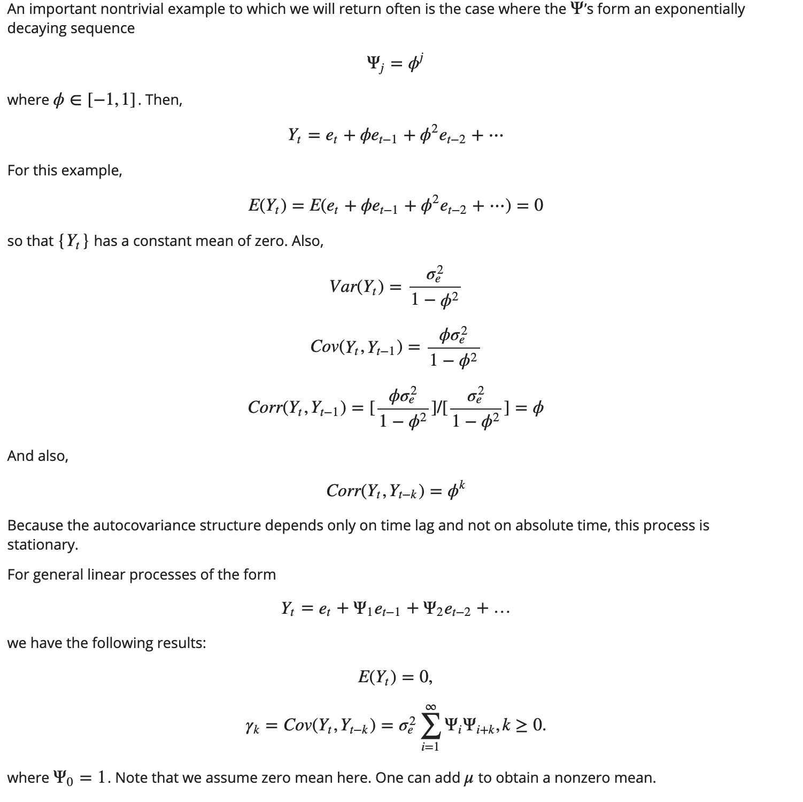

# Models for Stationary Time Series - Week 3

# TODO:
- [ ] at Friday 7.32 looking for 
- [ ] R^2, significant coefficients, and something in competition


- **μ** - Mean of series
- **Ψ<sub>i</sub>** - Coefficients of general linear process.
- **e<sub>t</sub>** - Sequence of uncorrelated Random Variables (rvs).
- **ϕ** - Coefficients of general linear process 
   - defined in between -1 and 1.  
- **θ<sub>i</sub>** - Coefficients of moving average process.  
- **MA(q)** - Moving average process of order q.  
- **ϕi** - Coefficients of autoregressive process.  
- **AR(p)** - Autoregressive process of order q.  
- **ARMA(p,q)** - Autoregressive moving average process of order p and q. 

Also:
- ρt,s: Correlation between lags t and s of a time series data. 
- γt,s: Covariance between lags t and s of a time series data. 

## !Contents (TODO:)
- [ ] Introduction
- [ ] Online Notes (plus pdf)
- [ ] Presentation (plus pdf)
- [ ] Tasks
- [ ] Interactive Apps
  - [ ] [Time series, ACF, and PACF plots for MA(q) processes]
  - [ ] [Time series, ACF, and PACF plots for AR(p) processes]
  - [ ] [Time series, ACF, and PACF plots for ARMA(p,q) processes]
- [ ] Supplementary Material - ACF and PACF
- [ ] Chapter 4 of our [textbook]
- [ ] Assignment 2

## Introduction

We will focus on 
- [ ] general linear processes
- [ ] moving average processes
- [ ] autoregressive processes
- [ ] the mixed Autoregressive Moving Average (ARMA) models and invertibility. 

These concepts provide required basis for one of the frequently used ARMA methodology. 
- [ ] hands-on task session to deepen your understanding of ARMA models
- [ ] stationary and non-stationary, and 
- [ ] seasonal and non-seasonal time series models

## Notes
- [Online Notes]
- [Online Notes pdf]
- [Presentation pdf]
- [Supplementary Material]

### ARMA Autoregressive moving average 

- models constitute a wide class of parametric time series models

Include 3 processes: which are the logic behind the ARMA models
- [ ] general linear processes
- [ ] moving average processes
- [ ] autoregressive processes

Then we will focus on:
- [ ] the mixed Autoregressive Moving Average (ARMA) model
- [ ] invertibility

### general linear processes **Y<sub>t</sub>**

A general linear process, Y<sub>t</sub>, is:
- weighted,
- linear combination of present and past white noise

-  {Y~t} = Time series
-  {e~t} = White noise - unobserved white noise series, 
  - a sequence of identically distributed, zero-mean, independent random variables

graphs:


Expectation of Y<sub>t</sub> is 0

ϕ co-efficient of GLP


  Yt=et+Ψ1et−1Ψ2et−2+… TODO:

  provided that

  ∑1∞Ψ2i<∞.TODO:
  
  
What did he say at 7.33?   
ACF plot gives you ???
PACF plot gives you what you have in the series
  
 
 Also, the assumption of independence could be replaced by the weaker assumption that the {et} are uncorrelated random variables, but we will not pursue that slight generality.


### moving average processes (MA)

- if goes up down up down it's Moving Average
  - because fluctuations suggest moving average behaviour

- Order q is how many days should I go back?
- The autocorrelation cuts off after Lag<sub>q</sub>


#### First order moving average

Lag1
If you see one zero, and the rest is ... then you have a Moving Average Plog
- Therefore: Has no correlation beyond Lag1


Lag1 = means you're looking 1 step before

-Lag1 (negative)

#### Second order Moving Average Process

- go up to Lag2 or order2
- 2 significant correlations, and the rest are 0
- Scatter plot of MA(2) versus third lag (T<sub>t-3</sub>)

- θ<sup>2</sup> / ( 1 + θ<sup>2</sup><sub>1</sub> +  θ<sup>2</sup><sub>1</sub> )
- coefficients of MA process

#### The interactive app for Moving Average 

[Time series, ACF, and PACF plots for MA(q) processes]


### autoregressive processes (AR)

Regressing on itself

[Time series, ACF, and PACF plots for AR(p) processes]


### PACF's

Partial ACF autocorrelation somethings

```r
pacf(ar1.s, main-" PACF plot for the simulated AR(1) process")
```

- PACF of AR(p) process will vanish after lag p.


#### ARMA(p,q)

Combines AR and MA

**p** = order of AR
**q** = order of MA

Did he just say auto ARMA?

### Tasks

1. Simulate 100 observations from the following processes with variance of 1 using R and plot their sample ACF and PACF, and study the characteristics of the sample ACF and PACF to observe the true values of model parameters.

a) AR(1) with  LaTeX: \phi = 0.6 ϕ = 0.6 <br />
b) AR(1) with  LaTeX: \phi = -0.6 ϕ = − 0.6 <br />
c) AR(2) with LaTeX: \phi=[0.6, -0.6] ϕ = [ 0.6 , − 0.6 ] <br />
d) MA(1) with LaTeX: \theta = 0.5 θ = 0.5 <br />
e) MA(1) with LaTeX: \theta = -0.5 θ = − 0.5 <br />
f) MA(2) with LaTeX: \theta = [-0.5,0.5] θ = [ − 0.5 , 0.5 ] <br />
g) ARMA(1,1) with LaTeX: \phi = 0.6; \theta = 0.5 ϕ = 0.6 ; θ = 0.5 <br />
h) ARMA(1,1) with LaTeX: \phi=0.6; \theta=-0.5 ϕ = 0.6 ; θ = − 0.5 <br />
i) ARMA(1,1) with LaTeX: \phi=-0.6; \theta=0.5 ϕ = − 0.6 ; θ = 0.5 <br />
j) ARMA(1,1) with LaTeX: \phi=-0.6; \theta=-0.5 ϕ = − 0.6 ; θ = − 0.5 <br />
k) ARMA(2,2) with  LaTeX: \phi=[0.6,-0.6]; \theta=[-0.5,0.5] ϕ = [ 0.6 , − 0.6 ] ; θ = [ − 0.5 , 0.5 ] <br />


1. Load the simulated datasets into R. <br />
a) data.sim1Preview the document  <br />
b) data.sim2Preview the document  <br />
c) data.sim3Preview the document  <br />
d) data.sim4Preview the document  <br />
e) data.sim5Preview the document  <br />

2. Then use time series, sample ACF and PACF plots to infer about stationarity and orders of a possible ARMA model for each dataset.

### Interactive Apps
#### Supplementary Material - ACF and PACF


### Lecture


#### tldr (at the end of slides)


#### Goals


### Presentation Notes from reading 


#### From Canvas


#### Tasks - Models for Stationary Time Series


#### Resources:

[textbook]: https://link.springer.com/book/10.1007%2F978-0-387-75959-3
[Time series, ACF, and PACF plots for MA(q) processes](https://jbaglin.shinyapps.io/ts_app_3_1/)
[Time series, ACF, and PACF plots for AR(p) processes](https://jbaglin.shinyapps.io/ts_app_3_2/)
[Time series, ACF, and PACF plots for ARMA(p,q) processes](https://jbaglin.shinyapps.io/ts_app_3_3/)
[Online Notes](./course-material/Module 3 - Online Notes.html)
[Online Notes pdf](./course-material/MATH1318_Module3_notes.pdf)
[Presentation pdf](./course-material/MATH1318_Module3_pres.pdf)
[Supplementary Material](./course-material/MATH1318_Module 3_Supp.html)